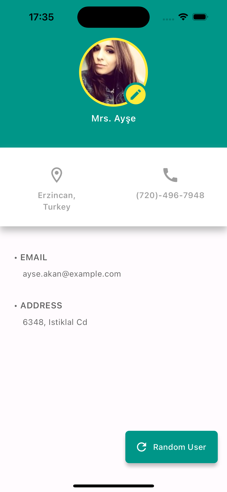

## Random User App

 Basic application where random user data is obtained and other differentes functionalities are obtained.

# Install

- Clone repository
- Run Commands in terminal :\
`flutter pub get`\
`flutter run`

# Technologies  
 - Flutter
 - Dart
 - Clean Architecture
 - Cubit + Freezed [State Management] 
 - Dio [Network Client]
 - Get It [Dependency Injection / Service Locator]
 - API used `https://randomuser.me/api/` 
 - Dartz Either for functional programming

 